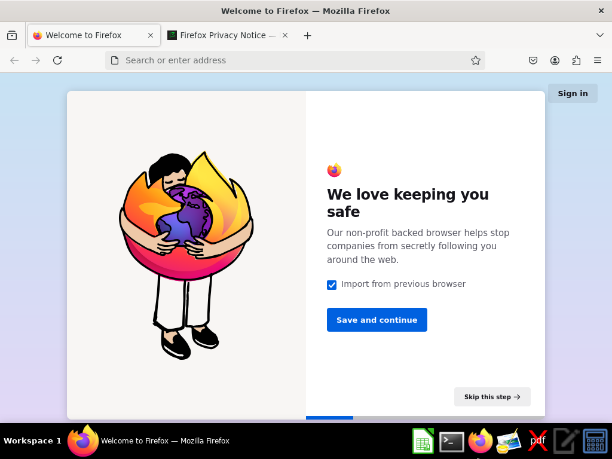

```python
from framework import Framework
import base64
from IPython.display import Image, display
```


```python
framework = Framework()
framework.start()
#Waiting for the container to be ready...
#Container started successfully with ID: ad9a149907197a70c5430255f870e3367b56777e549f4d9d6187eb17f0e94c3a
```
```python
coords = framework.vision_system("Find the firefox icon")
framework.mouse_move(coordinate=coords)
```
```python
screenshot = framework.screenshot()
display(Image(data=base64.b64decode(screenshot.json()['base64_image'])))
```


    

    


```python
framework.left_click()
```
```python
screenshot = framework.screenshot()
display(Image(data=base64.b64decode(screenshot.json()['base64_image'])))
```


    

    


```python
framework.stop()
#Container with ID: ad9a149907197a70c5430255f870e3367b56777e549f4d9d6187eb17f0e94c3a has been stopped
```
